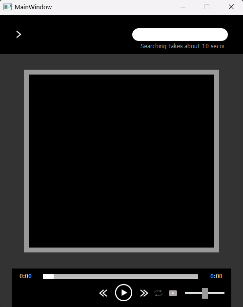
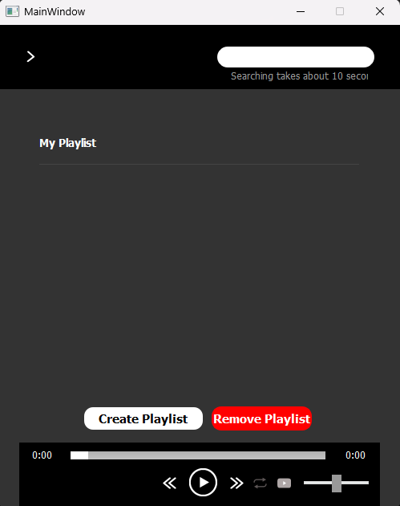

This is an audio application for you to listen to your favorite songs and make unlimited playlists. Make sure you've installed the requirements with 'pip install -r requirements.txt' and make sure you have vlc installed on your computer.

# MusicApp

## This is my first project after teaching myself to code during the pandemic. It is an application that allows you to create playlists and listen to music without ads. It scrapes youtube's database and lets you add songs to your playlist. It is a fully developed app. It has volume control, a video player, saves playlists to a file for future use, and more.

### Since I made this, Youtube has changed the way their requests work, so this application is out of date.

